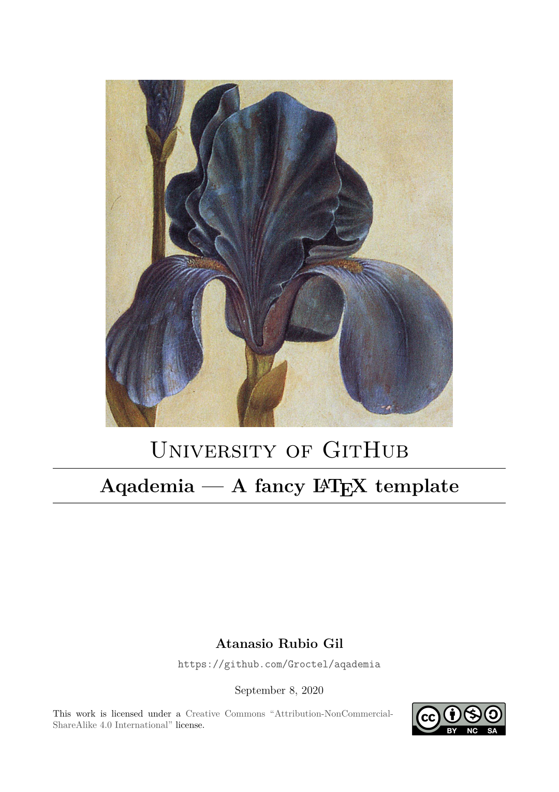

# Aqademia

**A TeX template for printable academic documents.**

This is a custom TeX template designed for note taking and posterior printing (hence the serif font).
It's a redesign of [advy99](https://github.com/advy99)'s template, which is a heavy redesign of one [Dunspa](https://github.com/Dunspa) provided us with.
We regretably can't find the primary source anywhere, sorry about that.
The listings style was inspired by [Wandmalfarbe](https://github.com/Wandmalfarbe)'s Eisvogel.

The placeholder image `src/titlepage.png` is *Troiana Iris* by Albrecht Dürer.

A demo is avaliable at the [releases](https://github.com/Groctel/aqademia/releases) page.



## Document properties

### Physical properties

This document is designed to be printed in European A4 paper and to fit as much text as possible in a single page without becoming too crowded (check the margins in `marginsrb`).
It uses `fancy` style headers and footers and coloured hyperlinks.

### Default values

This template provides some default values that can be changed to fit your document:

| Value                          | Line | Default                                     | Description                                |
| :----------------------------- | :--: | :------------------------------------------ | :----------------------------------------- |
| `\title`                       |  11  | `Aqademia`                                  | Title of the document.                     |
| `\author`                      |  12  | `Groctel`                                   | Author of the document.                    |
| `\date`                        |  13  | `\today`                                    | Date of the last version of the document.  |
| `\thesubtitle`                 |  14  | ` --- A TeX template`                       | Subtitle of the document (titlepage only). |
| `\theorganization`             |  15  | `University of GitHub`                      | Organization or other supertitle.          |
| `\therepository`               |  16  | `https://github.com/Groctel/aqademia`       | Link to the document's repository.         |
| `doclicense`                   |  17  | `{CC}{by-nc-sa}{4.0}`                       | Licence of the document.                   |
| `\lhead`                       |  48  | `Aqademia`                                  | Title of the document (header only).       |
| `\titleformat{\chapter}`       |  52  | `Part \thechapter:\\`                       | Chapter formatting.                        |
| `\titleformat{\section}`       |  53  | `Session\ \thesection:`                     | Section formatting.                        |
| `\titleformat{\subsection}`    |  54  | `\S\ \thesubsection:`                       | Subsection formatting.                     |
| `\titleformat{\subsubsection}` |  55  | `\thesubsubsection`                         | Subsubsection formatting.                  |
| `\graphicspath`                |  71  | `img/`                                      | Picture searching path.                    |
| `tabsize`                      |  97  | `3`                                         | Size of tabs in listings.                  |
| `\titleformat{\chapter}`       | 162  | `Appendix\ \MakeUppercase{\alph{chapter}}:` | Chapter formatting (appendices only).      |

## Dependencies

The font used in listings is `Libertine Mono` (It is scaled down in inline code sections).
The document is designed to be build with `XeTeX`.

## Building

```bash
cd src
xelatex aqademia.tex
```

## About appendices

### Differences over sessions

While the chapter is declared outside the `input` files in the sessions, it is declared as the appendices header.
The `section` command is substituted by the `subsection` command previously used, so that the style is conserved without losing a sectioning level.

#### Subsections

The `subsection` level is also substituted by `subsubsection`.

### Numbering

Appendices are referred to as a letter, starting from letter `A`.


